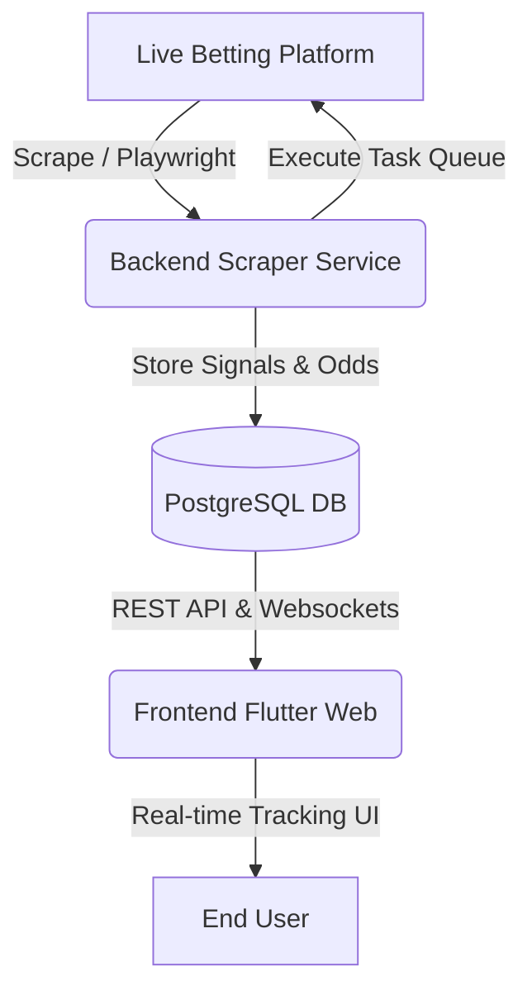

# Football Hunter - Systems Architecture & Automation Knowledge Base

This document captures the systems architecture, core techniques, database patterns, and advanced Playwright browser automation strategies used in the **Football Hunter 2** project. It is structured as a premium reference guide for AI agents (such as Gemini) and developers to understand the project's codebase and apply these techniques to other complex web scraping and automation systems.

---

## 🗺️ Project Architecture Overview

Football Hunter 2 is a high-frequency automated football betting and signal-tracking platform consisting of two main layers:



### 1. Technology Stack
*   **Backend:** Node.js, TypeScript, Express, Prisma ORM, PostgreSQL, Playwright (for Browser Automation).
*   **Frontend:** Flutter Web, `http-server` (for static hosting).
*   **Databases:** PostgreSQL (persistent logs and signals).

---

## 🛠️ Advanced Browser Automation Techniques (Playwright)

The core value of this project lies in its **highly stable, self-healing browser automation** built on Playwright. Public betting platforms use dynamic rendering, anti-bot mechanisms, frequent popups, and sliding layouts. The techniques below ensure a **99.9% success rate** under high load.

### 1. The Sequential Task Queue (`startQueueProcessor`)
To avoid browser execution conflicts (multiple threads clicking the same page), the bot uses a sequential background queue processor.
*   **Mechanism:** Tasks (signals) are pushed into an array queue. A tick timer (every 5 seconds) checks the queue. If a task is present and no active task is running, it pops the task and runs it.
*   **Benefit:** Zero parallel-interaction conflicts. The browser operates in a strict single-threaded execution flow.

### 2. Self-Healing Queue Recovery & Redirection Check
Dynamically rendered pages often redirect the user to unrelated sub-pages (e.g. slots, advertisements, profile pages).
*   **Self-Healing Logic:** Inside the queue tick processor, the bot queries `page.url()`.
*   **Validation Check:** If the URL does not contain `/sport/` or `/soccer`, the bot prints a warning, puts the interrupted task back at the front of the queue, force-navigates back to `https://www.bet5688q.com/home/sport/soccer`, and sleeps for 5 seconds to stabilize before resuming.
*   **Code Pattern:**
    ```typescript
    const currentUrl = page.url();
    if (!currentUrl.includes('/sport/') && !currentUrl.includes('/soccer')) {
        logger.warn('Browser redirected or lost. Restoring to Sports page...');
        taskQueue.unshift(currentTask); // Re-queue
        await page.goto('https://www.bet5688q.com/home/sport/soccer');
        await page.waitForTimeout(5000);
        return;
    }
    ```

### 3. Layout Stabilization Buffers (Defeating Layout Shifts)
Dynamic elements shift as images and assets load, causing accidental clicks.
*   **Technique:** Introduce timeouts at critical transaction milestones (e.g. 3000ms at task start, 5000ms on Odds page load, 2000ms before click confirmation).
*   **Rule of Thumb:** A 3–5 second delay on high-frequency transactions saves hours of session-recovery overhead.

### 4. Side-Aware Match Selection (Scope-Bound Locating)
When searching for a match, multiple similar odds boxes appear. Scoping coordinates target selections safely.
*   **Incorrect:** Querying `page.click('text="0.75"')` might click the opponent's or another game's line.
*   **Correct:** Search for the league section block, find the specific match header block, and scope selectors specifically to that row or team side (Home vs. Away column).
*   **Strict Line Matching:** Compare lines explicitly including symbols (e.g. `+0.75` vs `-0.75` are strictly different).

### 5. Virtual Keypad Emulation with Keyboard Fallback
Many platforms block raw element value writing (`element.fill('10')`) to prevent automation.
*   **Virtual Keypad Clicker:** Emulate mouse clicks on the platform's custom numeric buttons (0-9) on the screen.
*   **Sleep Intervals:** Wait 1000ms between typing "1" and "0" to let the site's input listener register changes.
*   **Hardware Fallback:** If buttons are covered or missing, use `page.keyboard.type('10')` as a backup, checking the field's actual text after typing and retrying if incorrect.

### 6. Post-Bet Cleanup & Mask/Overlay Clearance
After a bet is placed, success screens or background overlays (masks) freeze navigation.
*   **Resolution:** Program the bot to click outside the dialog (on the dark background overlay/mask) to dismiss the success window, check for promotional popups, wait 4000ms, and fall back to a force reload if navigation back to the main sports tab is blocked.

### 7. Collision Avoidance in Multi-Mode Running
*   **Scenario:** Running the Auto-Bot (Real-time auto placement) while simultaneously launching manual bulk tests (Test Bot Mode) on the same browser instance causes command clashes.
*   **Prevention Logic:** The frontend `SignalProvider` intercepts the "Start Testing" request. If `isBrowserReady` (Auto-Bet: ON) is active, it flags it false and posts a disable request to `/browser/ready` to pause the database scraper interval before enqueuing test tasks. This frees the single-thread processor for the Test Bot.

---

## 🗄️ Database Management & High-Throughput Cleansing

Due to rapid scraping (crawling live odds multiple times per minute), tables like `OddsHistory` can bloat to **400,000+ rows** in a single day, degrading query response times.

### 1. Cascading Truncation (`clean-db.js` / `manual-cleanup.ts`)
To safely reset the environment without breaking relational integrity, a dedicated raw PostgreSQL script is used.
*   **CASCADE Execution:** Truncating master tables like `Match` with `CASCADE` automatically clears all child records (`Odds`, `OddsHistory`, `Signal`, `Bet`, `RealBetLog`) in a single transaction.
*   **Prisma Raw SQL Execution:**
    ```typescript
    await prisma.$executeRawUnsafe(`TRUNCATE TABLE "Bet", "Signal", "OddsHistory", "Odds", "Match", "RealBetLog" CASCADE;`);
    ```
*   **Benefit:** Instantly wipes gigabytes of data and handles foreign key constraints without triggering database violations.

---

## 🎨 Frontend Design Patterns (Flutter Web)

The tracking UI is designed to give the user instant real-time reassurance that the bot is running properly.

### 1. Dual Summary Board (Mock vs. Real Bot)
*   **Design Rationale:** Shows the theoretical success rate of the scraper signals (Mock up Bot) alongside the real physical executions on the betting site (Real Bot).
*   **Win Rate Metrics:** Instantly calculates the win rate from settled bets: `settledCount = wonCount + lostCount; winRate = (wonCount / settledCount) * 100`.

### 2. Perfect Data Binding (Real Bets Column Mapping)
*   **Problem:** Columns for "Won/Lost/Pending" bets showed mock values instead of the real bot logs.
*   **Solution:** Map the cards and counts in the bottom columns directly from the active `filteredRealBets` list by matching them with their corresponding `Bet` entity from `allBets` using the shared `signalId`.
*   **Result:** The totals shown in the columns perfectly match the totals shown on the summary board.

### 3. State-Memorized UI Reset Pattern
*   **Problem:** Resetting log overlays and top status bars on test completion would fail because state transitions occurred before checking.
*   **Solution:** Introduce a temporary variable (`wasTestRunning`) that caches the previous render loop state. Check this cache against the new backend response:
    ```dart
    bool wasTestRunning = _isTestRunning;
    if (testRunning != _isTestRunning) {
      _isTestRunning = testRunning;
    }
    if (queueEmpty && !testRunning && wasTestRunning) {
      _selectedSignalIds.clear();
      _testLogs.clear();
      _testStatus = "ระบบพร้อมทดสอบ";
    }
    ```
    This ensures that when a test finishes, it triggers UI cleanup and pulls fresh data cleanly.

---

## 💻 Operations & Port Control Cheat Sheet

### 1. Port Collision Resolution (`EADDRINUSE`)
*   **Issue:** Force restarting the server without terminating child threads leaves port `3000` bound.
*   **Solution Script (`npm run kill`):**
    ```json
    "scripts": {
      "kill": "npx kill-port 3000"
    }
    ```
*   **Windows Powershell Recovery:** Find the PID and kill it manually:
    ```powershell
    netstat -ano | findstr :3000
    taskkill /F /PID <PID_NUMBER>
    ```

### 2. Isolated Logging Strategy
*   **Production Logs (`bot.log`):** Tracks scraper runs and live match updates.
*   **Simulation Logs (`testbot.log`):** Tracks dry runs and mock bets.
